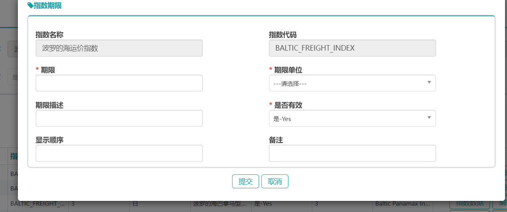

# 系统管理

## 菜单管理

## 字典管理

### 字典查询

### 字典添加

### 字典编辑

### 字典删除

## 用户管理

字典管理

### 用户查询

### 用户添加

### 编辑

### 删除

### 更改状态

当点击更改状态时正常\冻结状态相互切换

## 机构管理

### 机构查询

### 机构添加

### 机构修改

### 删除

## 角色管理

### 角色查询

### 角色添加

### 角色修改

### 删除

## 权限管理

### 权限查询

### 新增权限

### 修改权限

### 删除

## 指数管理

### 指数查询

### 指数新增

### 指数删除

### 指数修改

### 指数期限管理

#### 新增指数期限

#### 删除指数期限

#### 编辑指数期限

#### 指数数据管理

##### 指数数据新增

##### 指数数据编辑

##### 指数数据删除

## spv管理

### 新增

### 编辑

### 删除

# 资产管理

# 收款管理

# 采购合同管理

# 租赁合同管理

## 合同维护

## 合同管理
